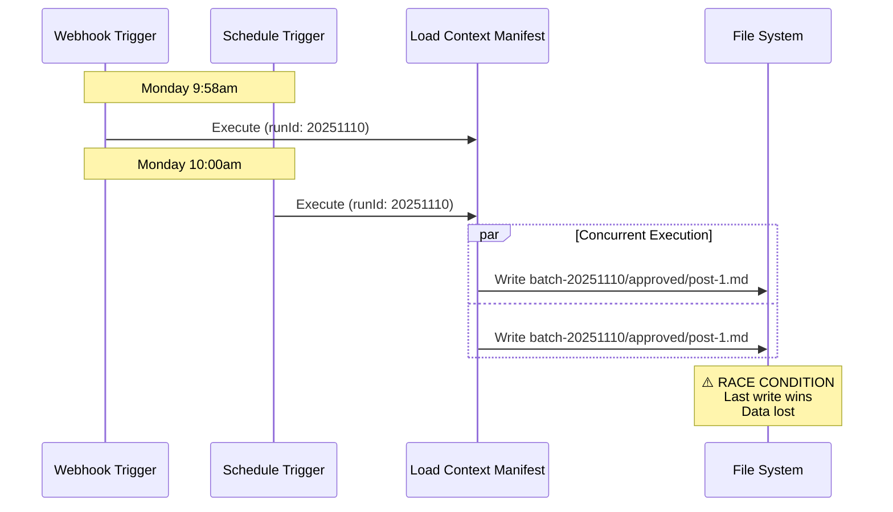
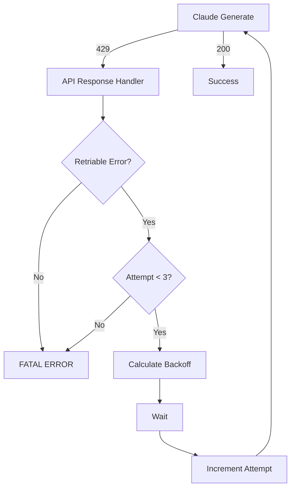

# Failure Scenarios - Non-Happy Path Flows

## Overview

Detailed failure scenarios and non-happy path flows for the AI-Whisperers Content Generator. Each scenario includes flow diagrams, failure conditions, detection methods, and recovery paths.

---

## Table of Contents

1. [Race Condition Scenarios](#race-condition-scenarios)
2. [Context Validation Failures](#context-validation-failures)
3. [File Read/Normalize/Validate Failures](#file-readnormalizevalidate-failures)
4. [API Failure Scenarios](#api-failure-scenarios)
5. [Validation Contract Failures](#validation-contract-failures)
6. [Version Collision Scenarios](#version-collision-scenarios)

---

## Race Condition Scenarios

### Scenario 1A: Concurrent Webhook + Schedule Trigger

**Failure Condition:** Webhook fires at 9:58am, schedule fires at 10:00am on same day



**Happy Path:**
```
Webhook → Manifest → Generate → Write → Complete
```

**Failure Path:**
```
Webhook → Manifest → Generate → Write ━━━━┓
                                          ╋━━ COLLISION
Schedule → Manifest → Generate → Write ━━━┛
```

**Detection:**
```javascript
// Check for concurrent executions
const runningCount = await fetch('/api/v1/executions?status=running&workflowId=content-generator-v2')
  .then(r => r.json())
  .then(data => data.data.length);

if (runningCount > 1) {
  throw new Error('RACE_CONDITION: Multiple executions detected');
}
```

**Recovery:**
```
1. Detect concurrent execution
2. Abort newer execution
3. Wait for older execution to complete
4. Retry after delay
```

---

### Scenario 1B: Multiple Manual Triggers Same Day

**Failure Condition:** Developer triggers workflow multiple times for testing

```
Run 1 (10:00am): runId = 20251110
├─ Generates 5 posts
├─ Writes to batch-20251110/approved/
└─ Complete

Run 2 (11:30am): runId = 20251110  ⚠️ SAME ID
├─ Generates 5 posts
├─ Writes to batch-20251110/approved/  ⚠️ OVERWRITES
└─ Complete (Run 1 data LOST)
```

**Happy Path with Fix:**
```
Run 1: runId = 20251110-100000
Run 2: runId = 20251110-113000
Both write to separate directories, no collision
```

**Prevention:**
```javascript
// Use millisecond-precision timestamp
const runId = new Date().toISOString()
  .replace(/[-:]/g, '')
  .replace('T', '-')
  .split('.')[0];
// Output: 20251110-100000 (YYYYMMDD-HHMMSS)
```

---

### Scenario 1C: Execution Queue Overflow

**Failure Condition:** 5 webhook triggers within 1 minute

```
Trigger 1 → Queue position 1 → Execute
Trigger 2 → Queue position 2 → Wait
Trigger 3 → Queue position 3 → Wait
Trigger 4 → Queue position 4 → Wait
Trigger 5 → Queue position 5 → REJECT (queue full)
```

**Queue Management:**
```javascript
// NEW NODE: Execution Queue Manager
const QUEUE_MAX_SIZE = 3;
const QUEUE_MAX_WAIT_TIME = 600000; // 10 minutes

const queue = await loadQueue();  // From persistent storage

if (queue.length >= QUEUE_MAX_SIZE) {
  throw new Error('QUEUE_FULL: Maximum queue size reached. Try again later.');
}

// Add to queue
queue.push({
  executionId: $execution.id,
  enqueuedAt: new Date().toISOString(),
  priority: 'normal'
});

await saveQueue(queue);

// Wait for queue position
while (queue[0].executionId !== $execution.id) {
  await sleep(5000);  // Check every 5 seconds

  // Timeout check
  const waitTime = Date.now() - new Date(queue.find(q => q.executionId === $execution.id).enqueuedAt);
  if (waitTime > QUEUE_MAX_WAIT_TIME) {
    throw new Error('QUEUE_TIMEOUT: Waited too long in queue');
  }
}

// Remove from queue and continue
queue.shift();
await saveQueue(queue);
```

---

## Context Validation Failures

### Scenario 2A: Missing sources Array

**Failure Condition:** Context manifest is malformed

```javascript
// BAD MANIFEST
{
  "version": "2.0.0",
  "run_id": "20251110",
  // sources: [] // ← MISSING!
  "created_at": "2025-11-10T10:00:00Z"
}
```

**Current Behavior (BROKEN):**
```
Load Manifest → Split Sources → sources = [] → No files read
                                              ↓
                                Merge All Contexts → {} empty
                                              ↓
                                Pre-Model Guardrails → PASS (no validation)
                                              ↓
                                Claude Generate → Invalid prompt
                                              ↓
                                FAILURE or garbage output
```

**Corrected Behavior:**
```
Load Manifest → Validate Manifest → FAIL: sources undefined
                                  ↓
                                ERROR: MANIFEST_INVALID
                                  ↓
                                ABORT workflow
```

**Validation Logic:**
```javascript
// NEW NODE: Validate Manifest
const manifest = $input.first().json;

if (!manifest.sources) {
  throw new Error('MANIFEST_INVALID: sources array is undefined');
}

if (!Array.isArray(manifest.sources)) {
  throw new Error('MANIFEST_INVALID: sources is not an array');
}

if (manifest.sources.length === 0) {
  throw new Error('MANIFEST_INVALID: sources array is empty');
}

// Continue to Split Sources
return { json: manifest };
```

---

### Scenario 2B: Invalid Source Structure

**Failure Condition:** Source objects missing required fields

```javascript
{
  "sources": [
    {
      "file": "/path/to/file.md",  // Should be "path"
      "type": "brand"               // Should be "category"
      // Missing: priority, required
    }
  ]
}
```

**Current Behavior (BROKEN):**
```
Split Sources → Extract source → { file: '...', type: '...' }
                                          ↓
                            Read Context File → Try to read $json.path
                                          ↓
                                  FAIL: path is undefined
                                          ↓
                                  Generic error, hard to debug
```

**Corrected Behavior:**
```
Validate Manifest → Check each source schema
                              ↓
                    FAIL: Source 0 missing field "path"
                              ↓
                    ERROR: MANIFEST_INVALID
                              ↓
                    ABORT with clear error message
```

**Validation Logic:**
```javascript
const requiredFields = ['path', 'category', 'priority', 'required'];

manifest.sources.forEach((source, index) => {
  requiredFields.forEach(field => {
    if (!(field in source)) {
      throw new Error(`MANIFEST_INVALID: Source ${index} missing required field "${field}"`);
    }
  });

  // Validate field types
  if (typeof source.path !== 'string' || source.path.length === 0) {
    throw new Error(`MANIFEST_INVALID: Source ${index} path must be non-empty string`);
  }

  if (!['services', 'brand', 'projects', 'team'].includes(source.category)) {
    throw new Error(`MANIFEST_INVALID: Source ${index} invalid category "${source.category}"`);
  }

  if (typeof source.priority !== 'number' || source.priority < 1 || source.priority > 5) {
    throw new Error(`MANIFEST_INVALID: Source ${index} priority must be 1-5`);
  }

  if (typeof source.required !== 'boolean') {
    throw new Error(`MANIFEST_INVALID: Source ${index} required must be boolean`);
  }
});
```

---

### Scenario 2C: Duplicate Sources

**Failure Condition:** Same file listed multiple times

```javascript
{
  "sources": [
    { "path": "/brand/voice.md", "category": "brand", "priority": 1, "required": true },
    { "path": "/brand/voice.md", "category": "brand", "priority": 1, "required": true }  // DUPLICATE
  ]
}
```

**Current Behavior:**
```
Split → Read voice.md → Normalize → Validate
                                      ↓
Split → Read voice.md → Normalize → Validate
                                      ↓
Merge → { brand: [voice, voice] }  ← Duplicate data, wasted API tokens
```

**Corrected Behavior:**
```
Validate Manifest → Detect duplicate paths
                              ↓
                    FAIL: Duplicate source "/brand/voice.md"
                              ↓
                    ERROR: MANIFEST_INVALID
```

**Detection Logic:**
```javascript
const paths = manifest.sources.map(s => s.path);
const uniquePaths = new Set(paths);

if (paths.length !== uniquePaths.size) {
  const duplicates = paths.filter((p, i) => paths.indexOf(p) !== i);
  throw new Error(`MANIFEST_INVALID: Duplicate sources: ${duplicates.join(', ')}`);
}
```

---

## File Read/Normalize/Validate Failures

### Scenario 3A: File Not Found

**Failure Condition:** Required context file doesn't exist

**Current Behavior (BROKEN):**
```
Read File → fileData.data = undefined
              ↓
Normalize → rawContent = '' (empty string)
              ↓
Validate → word_count = 0
              ↓
FAIL: "Context too short"  ← MISLEADING ERROR
```

**Corrected Behavior (3 Separate Nodes):**
```
Read File → FAIL: ENOENT file not found
              ↓
        Set error flag
              ↓
Normalize → Check for error flag
              ↓
        Skip normalization
              ↓
Validate → Check for error flag
              ↓
        FAIL: "FILE_NOT_FOUND: /path/to/file.md"  ← CLEAR ERROR
```

**Implementation:**
```javascript
// NODE 1: Read File (unchanged)
// Let it fail naturally

// NODE 2: Normalize (NEW)
const sourceInfo = $('Split Sources').item.json;
const fileDataInput = $input.all();

// Check if read failed
if (fileDataInput.length === 0 || !fileDataInput[0].json.data) {
  return {
    json: {
      source: sourceInfo,
      error: 'FILE_NOT_FOUND',
      error_message: `File does not exist: ${sourceInfo.path}`,
      skip_validation: true
    }
  };
}

const rawContent = fileDataInput[0].json.data;

// Continue with normalization
const normalized = {
  source: sourceInfo,
  content: {
    raw: rawContent,
    word_count: rawContent.split(/\s+/).filter(w => w.length > 0).length,
    // ...
  },
  metadata: {
    normalized: true,
    normalized_at: new Date().toISOString()
  }
};

return { json: normalized };
```

---

### Scenario 3B: Empty File

**Failure Condition:** File exists but has no content

**Current Behavior (BROKEN):**
```
Read File → fileData.data = ''
              ↓
Normalize → rawContent = ''
              ↓
Validate → word_count = 0
              ↓
FAIL: "Context too short"  ← AMBIGUOUS
```

**Corrected Behavior:**
```
Read File → fileData.data = ''
              ↓
Normalize → Detect empty content
              ↓
        Return error object
              ↓
Validate → Check error flag
              ↓
        FAIL: "FILE_EMPTY: /path/to/file.md"  ← PRECISE ERROR
```

**Implementation:**
```javascript
// NODE 2: Normalize
const rawContent = fileDataInput[0].json.data || '';

if (rawContent.trim().length === 0) {
  return {
    json: {
      source: sourceInfo,
      error: 'FILE_EMPTY',
      error_message: `File is empty: ${sourceInfo.path}`,
      skip_validation: true,
      content: { raw: '', word_count: 0, char_count: 0, sections: [] }
    }
  };
}

// Continue with normalization...
```

---

### Scenario 3C: Malformed Content (Binary Data)

**Failure Condition:** File contains non-text data

**Current Behavior (BROKEN):**
```
Read File → fileData.data = '\x00\x01\x02...' (binary)
              ↓
Normalize → rawContent.split() produces garbage
              ↓
Validate → May pass or fail unpredictably
```

**Corrected Behavior:**
```
Read File → fileData.data = binary
              ↓
Normalize → Detect non-text content
              ↓
        Return error object
              ↓
Validate → FAIL: "FILE_INVALID: File contains binary data"
```

**Detection Logic:**
```javascript
// NODE 2: Normalize
const rawContent = fileDataInput[0].json.data || '';

// Check for binary content
const containsBinary = /[\x00-\x08\x0E-\x1F]/.test(rawContent);
if (containsBinary) {
  return {
    json: {
      source: sourceInfo,
      error: 'FILE_INVALID',
      error_message: `File contains binary data: ${sourceInfo.path}`,
      skip_validation: true
    }
  };
}

// Continue with normalization...
```

---

### Scenario 3D: Content Below Validation Threshold

**Failure Condition:** File has <10 words but is otherwise valid

**Current Behavior (BROKEN):**
```
Normalize + Validate (combined)
  ↓
FAIL: "Context too short"
  ↓
Normalized data is LOST (cannot recover)
```

**Corrected Behavior:**
```
Normalize → Produce normalized structure
              ↓
Validate → Check word count
              ↓
        FAIL but KEEP normalized data
              ↓
        Return: { error: 'VALIDATION_FAILED', normalized: {...} }
              ↓
        Downstream can decide: retry with lower threshold OR skip file
```

**Implementation:**
```javascript
// NODE 3: Validate
const normalized = $input.first().json;

// Skip validation if previous error
if (normalized.error && normalized.skip_validation) {
  return { json: { ...normalized, validation_status: 'SKIPPED' }};
}

const issues = [];

// Validation rules
if (normalized.content.word_count < 10) {
  issues.push({
    rule: 'MIN_WORD_COUNT',
    message: `Content too short: ${normalized.content.word_count} words (min 10)`,
    severity: 'ERROR'
  });
}

// For required files, throw error
if (normalized.source.required && issues.length > 0) {
  throw new Error(
    `VALIDATION_FAILED: ${normalized.source.path}\n` +
    issues.map(i => `  - ${i.message}`).join('\n')
  );
}

// For optional files, return with validation metadata
return {
  json: {
    ...normalized,
    validation: {
      passed: issues.length === 0,
      issues: issues,
      validated_at: new Date().toISOString()
    }
  }
};
```

---

## API Failure Scenarios

### Scenario 4A: Rate Limit (429)

**Failure Condition:** Claude API returns 429 Too Many Requests

```
Claude Generate → POST /v1/messages
                        ↓
                  Response: 429
                        ↓
                  {
                    "error": {
                      "type": "rate_limit_error",
                      "message": "Rate limit exceeded"
                    }
                  }
```

**Current Behavior (BROKEN):**
```
Claude Generate → 429
                   ↓
              FAIL: "Request failed with status code 429"
                   ↓
              Workflow aborted
                   ↓
              All context loading work WASTED
```

**Corrected Behavior:**
```
Claude Generate → 429
                   ↓
        API Response Handler → Detect rate_limit_error
                   ↓
        Check retry count (1/3)
                   ↓
        Calculate backoff (2 seconds)
                   ↓
        Wait 2 seconds
                   ↓
        Retry → Claude Generate
                   ↓
        SUCCESS or continue retry loop
```

**Retry Flow Diagram:**


**Implementation:**
```javascript
// NODE: API Response Handler
const response = $input.first().json;
const checkpoint = $('Pre-API Checkpoint').first().json;

// Check for errors
const hasError = response.error || !response.content;

if (hasError) {
  const errorType = response.error?.type || 'UNKNOWN';
  const errorMessage = response.error?.message || 'No content in response';

  // Define retriable errors
  const retriableErrors = [
    'rate_limit_error',      // 429
    'overloaded_error',      // 529
    'api_error',             // 500, 502, 503
    'timeout_error'          // Request timeout
  ];

  const isRetriable = retriableErrors.includes(errorType);

  if (isRetriable && checkpoint.attempt < checkpoint.max_attempts) {
    // Calculate exponential backoff: 2s, 4s, 8s
    const backoffMs = Math.pow(2, checkpoint.attempt) * 1000;

    console.log(`RETRY: ${errorType} (Attempt ${checkpoint.attempt}/${checkpoint.max_attempts})`);
    console.log(`Waiting ${backoffMs}ms before retry...`);

    // Wait
    await new Promise(resolve => setTimeout(resolve, backoffMs));

    // Increment attempt counter
    checkpoint.attempt += 1;

    // Return to Pre-API Checkpoint (triggers retry)
    throw new Error(`RETRY_${errorType}`);
  } else {
    // Non-retriable or max attempts reached
    throw new Error(`FATAL_API_ERROR: ${errorType} - ${errorMessage}`);
  }
}

// Success
return { json: response };
```

---

### Scenario 4B: Timeout

**Failure Condition:** API request takes >30 seconds

**Current Behavior (BROKEN):**
```
Claude Generate → Request sent
                       ↓
                  (30 seconds pass)
                       ↓
                  n8n timeout
                       ↓
                  FAIL: "ETIMEDOUT"
                       ↓
                  Workflow aborted
```

**Corrected Behavior:**
```
Claude Generate → Request sent (with 30s timeout)
                       ↓
                  (30 seconds pass)
                       ↓
                  Timeout detected
                       ↓
        API Response Handler → Detect timeout_error
                       ↓
        Retry with backoff (Attempt 1/3)
                       ↓
        SUCCESS or continue retry
```

**Configuration:**
```javascript
// MODIFIED: Claude Generate node
{
  "parameters": {
    "timeout": 30000,  // 30 second timeout
    "ignoreResponseCode": true,  // Don't auto-fail on errors
    // ...
  }
}
```

---

### Scenario 4C: Invalid JSON Response

**Failure Condition:** API returns 200 but response is not valid JSON

**Current Behavior (BROKEN):**
```
Claude Generate → 200 OK
                       ↓
                  Body: "<!DOCTYPE html>..." (HTML error page)
                       ↓
Hard Validator → JSON.parse()
                       ↓
                  FAIL: "Unexpected token < in JSON"
                       ↓
                  Cryptic error, hard to debug
```

**Corrected Behavior:**
```
Claude Generate → 200 OK
                       ↓
                  Body: "<!DOCTYPE html>..."
                       ↓
        API Response Handler → Validate response structure
                       ↓
                  Check: response.content exists?
                       ↓
                  FAIL: "INVALID_RESPONSE: Response missing content field"
                       ↓
                  Retry (non-retriable, abort after 1 attempt)
```

**Validation Logic:**
```javascript
// NODE: API Response Handler
const response = $input.first().json;

// Validate response structure
if (!response.content) {
  throw new Error('INVALID_RESPONSE: Response missing content field');
}

if (!Array.isArray(response.content)) {
  throw new Error('INVALID_RESPONSE: content field is not an array');
}

if (response.content.length === 0) {
  throw new Error('INVALID_RESPONSE: content array is empty');
}

if (!response.content[0].text) {
  throw new Error('INVALID_RESPONSE: content[0].text is undefined');
}

// Valid response
return { json: response };
```

---

### Scenario 4D: API Overloaded (529)

**Failure Condition:** Claude API is temporarily overloaded

**Current Behavior (BROKEN):**
```
Claude Generate → 529 Overloaded
                       ↓
                  FAIL: "Request failed with status code 529"
                       ↓
                  Workflow aborted
```

**Corrected Behavior:**
```
Claude Generate → 529
                   ↓
        API Response Handler → Detect overloaded_error
                   ↓
        Retry with exponential backoff
                   ↓
        Attempt 1: Wait 2s → Retry
        Attempt 2: Wait 4s → Retry
        Attempt 3: Wait 8s → Retry
                   ↓
        SUCCESS or FATAL after 3 attempts
```

**Same retry logic as rate_limit_error (429)**

---

## Validation Contract Failures

### Scenario 5A: Contains Forbidden Words

**Failure Condition:** Generated post contains marketing hype words

**Input:**
```json
{
  "hook": "This revolutionary AI solution will transform your business!",
  "body": "...",
  "cta": "Ready for a game-changing experience?"
}
```

**Current Behavior (ARBITRARY):**
```
Hard Validator → Check forbidden words
                       ↓
                  Found: "revolutionary", "transform your", "game-changing"
                       ↓
                  issues.length = 3
                       ↓
                  quality_score = 100 - (3 * 20) = 40
                       ↓
                  status = 40 < 70 ? 'NEEDS_REVISION' : 'APPROVED'
                       ↓
                  Result: NEEDS_REVISION
```

**Corrected Behavior (CONTRACT-BASED):**
```
Hard Validator → Run validation contract
                       ↓
        Check CRITICAL rules:
          ✅ has_required_fields: PASS
          ❌ no_forbidden_words: FAIL
          ✅ valid_word_count: PASS
                       ↓
        Critical rule failed → status = 'REJECTED'
                       ↓
        Branch: REJECTED path (not written to disk)
```

**Contract Definition:**
```javascript
const VALIDATION_CONTRACT = {
  critical: {
    no_forbidden_words: {
      rule: post => {
        const forbidden = ['revolutionary', 'game-changing', 'disruptive', 'transform your'];
        const text = `${post.hook} ${post.body} ${post.cta}`.toLowerCase();
        return !forbidden.some(word => text.includes(word));
      },
      message: 'Contains forbidden marketing hype words',
      severity: 'CRITICAL'
    }
  }
};
```

---

### Scenario 5B: Word Count Out of Range

**Failure Condition:** Post is too short or too long

**Input:**
```json
{
  "word_count": 95,  // Below minimum of 120
  "hook": "Short hook.",
  "body": "Very brief body.",
  "cta": "Click here."
}
```

**Current Behavior (ARBITRARY):**
```
quality_score calculation (opaque)
status = score >= 70 ? 'APPROVED' : 'NEEDS_REVISION'
```

**Corrected Behavior (CONTRACT-BASED):**
```
Validation Contract → critical.valid_word_count
                            ↓
                      95 < 120 → FAIL
                            ↓
                      status = 'REJECTED'
```

---

### Scenario 5C: Edge Case - Exactly at Threshold

**Failure Condition:** Post scores exactly 70 in old system

**Current Behavior (ARBITRARY):**
```
quality_score = 70
status = 70 >= 70 ? 'APPROVED' : 'NEEDS_REVISION'
Result: APPROVED (but borderline quality)
```

**Corrected Behavior (CONTRACT-BASED):**
```
All CRITICAL rules: PASS
All IMPORTANT rules: PASS
→ status = 'APPROVED'

All CRITICAL rules: PASS
One IMPORTANT rule: FAIL
→ status = 'NEEDS_REVISION'

One CRITICAL rule: FAIL
→ status = 'REJECTED'
```

No ambiguous thresholds, clear pass/fail criteria.

---

## Version Collision Scenarios

### Scenario 6A: Same-Day Retry Overwrites

**Failure Condition:** Workflow runs twice on same day

**Current Behavior (BROKEN):**
```
Run 1 (10:00am):
  version = "v2.0.0-20251110-0"
  filename = "service-showcase-v2.0.0-20251110-0.md"
  writes to: batch-20251110/approved/service-showcase-v2.0.0-20251110-0.md

Run 2 (15:30pm):
  version = "v2.0.0-20251110-0"  ← SAME!
  filename = "service-showcase-v2.0.0-20251110-0.md"  ← SAME!
  writes to: batch-20251110/approved/service-showcase-v2.0.0-20251110-0.md

  ⚠️ OVERWRITES Run 1 without warning
```

**Corrected Behavior:**
```
Run 1 (10:00am):
  version = "v2.0.0-20251110-0"
  contentHash = "a3f5c2d1"
  filename = "v2.0.0-20251110-0-a3f5c2d1.md"

Run 2 (15:30pm):
  version = "v2.0.0-20251110-0"  ← SAME
  contentHash = "b7e4f9a2"  ← DIFFERENT (content changed)
  filename = "v2.0.0-20251110-0-b7e4f9a2.md"  ← UNIQUE!

Both files preserved, no collision
```

**Implementation:**
```javascript
// Normalize node
const crypto = require('crypto');

const contentHash = crypto
  .createHash('sha256')
  .update(post.full_text)
  .digest('hex')
  .substring(0, 8);

const filename = `${post.version}-${contentHash}.md`;
```

---

### Scenario 6B: Identical Content Re-generation

**Failure Condition:** Same prompt generates identical content

**Current Behavior:**
```
Run 1: Generates post, writes file
Run 2: Generates identical post, overwrites file (wasted API call)
```

**Corrected Behavior:**
```
Run 1: Generates post, writes file with contentHash = "a3f5c2d1"
Run 2: Generates identical post, contentHash = "a3f5c2d1"
       Check if file exists with same hash
       File exists → SKIP write, return existing file path
```

**Implementation:**
```javascript
// Normalize node
const fs = require('fs');
const filePath = `${baseDir}/generated-posts/batch-${batchDate}/${subdir}/${filename}`;

if (fs.existsSync(filePath)) {
  // File exists, check if content is identical
  const existingContent = fs.readFileSync(filePath, 'utf-8');
  const existingFullText = existingContent.match(/## READY TO POST\n\n([\s\S]*)/)?.[1] || '';

  const existingHash = crypto
    .createHash('sha256')
    .update(existingFullText)
    .digest('hex')
    .substring(0, 8);

  if (existingHash === contentHash) {
    console.log(`SKIP: Identical content already exists at ${filePath}`);
    return {
      json: {
        action: 'SKIPPED',
        reason: 'Identical content already exists',
        file_path: filePath,
        content_hash: contentHash
      }
    };
  }
}

// Content is different, continue with write
```

---

### Scenario 6C: Concurrent Writes to Same File

**Failure Condition:** Two executions write to same file simultaneously

**Current Behavior (BROKEN):**
```
Execution A: Writing to service-showcase.md
Execution B: Writing to service-showcase.md (simultaneously)

Result: Corrupted file or partial write
```

**Corrected Behavior:**
```
Execution A: Write to service-showcase-a3f5c2d1.md
Execution B: Write to service-showcase-b7e4f9a2.md

Different content hashes → different files → no collision
```

**Atomic Write Implementation:**
```javascript
// Write node
const fs = require('fs');
const path = require('path');

// Ensure directory exists
const dir = path.dirname(data.file_path);
fs.mkdirSync(dir, { recursive: true });

// Atomic write: write to temp file, then rename
const tempPath = `${data.file_path}.tmp.${process.pid}`;
fs.writeFileSync(tempPath, data.file_content, 'utf-8');

// Atomic rename (POSIX guarantees atomicity)
fs.renameSync(tempPath, data.file_path);

// Verify write
const verifyContent = fs.readFileSync(data.file_path, 'utf-8');
if (verifyContent !== data.file_content) {
  throw new Error(`WRITE_VERIFICATION_FAILED: ${data.file_path}`);
}

return {
  json: {
    ...data,
    write_successful: true,
    write_verified: true,
    written_at: new Date().toISOString()
  }
};
```

---

## Error Recovery Decision Tree

```
Error Detected
    ↓
Is it retriable? ─────────────┐
    ↓ Yes                      │ No
    │                          ↓
Attempt < Max? ─────┐      Abort workflow
    ↓ Yes           │ No        ↓
    │               ↓      Store error details
    │          Abort workflow   ↓
    │               ↓      Alert operator
Calculate backoff  Store error        ↓
    ↓              details        Manual recovery
Wait               ↓
    ↓         Alert operator
Retry              ↓
    ↓         Manual recovery
Success? ──────────┐
    ↓ Yes          │ No
    │              ↓
Continue       (loop to "Attempt < Max?")
workflow
```

---

## Summary: Non-Happy Path Coverage

| Scenario | Detection | Recovery | Automated? |
|----------|-----------|----------|------------|
| Race Condition | Execution queue | Abort duplicate | Yes |
| Missing Manifest Sources | Schema validation | Abort workflow | Yes |
| Invalid Source Structure | Schema validation | Abort workflow | Yes |
| Duplicate Sources | Duplicate detection | Abort workflow | Yes |
| File Not Found | Error flag | Skip or abort | Partial |
| Empty File | Content check | Skip or abort | Partial |
| Malformed Content | Binary detection | Skip or abort | Partial |
| API Rate Limit | Status code 429 | Retry 3x | Yes |
| API Timeout | Timeout detection | Retry 3x | Yes |
| Invalid API Response | Structure validation | Retry 1x | Yes |
| Forbidden Words | Contract validation | Reject | Yes |
| Word Count Invalid | Contract validation | Reject | Yes |
| Version Collision | Content hash | Skip or rename | Yes |
| Concurrent Writes | Atomic write | Retry | Yes |

---

## Related Documentation

- [ERROR_CATALOG.md](./ERROR_CATALOG.md) - Complete error reference
- [RETRY_STRATEGIES.md](./RETRY_STRATEGIES.md) - Detailed retry patterns
- [RECOVERY_PROCEDURES.md](./RECOVERY_PROCEDURES.md) - Step-by-step recovery
- [../operations/TROUBLESHOOTING.md](../operations/TROUBLESHOOTING.md) - Diagnostic procedures

---

**Version:** 1.0.0
**Last Updated:** 2025-11-10
**Workflow Version:** 2.0.0
